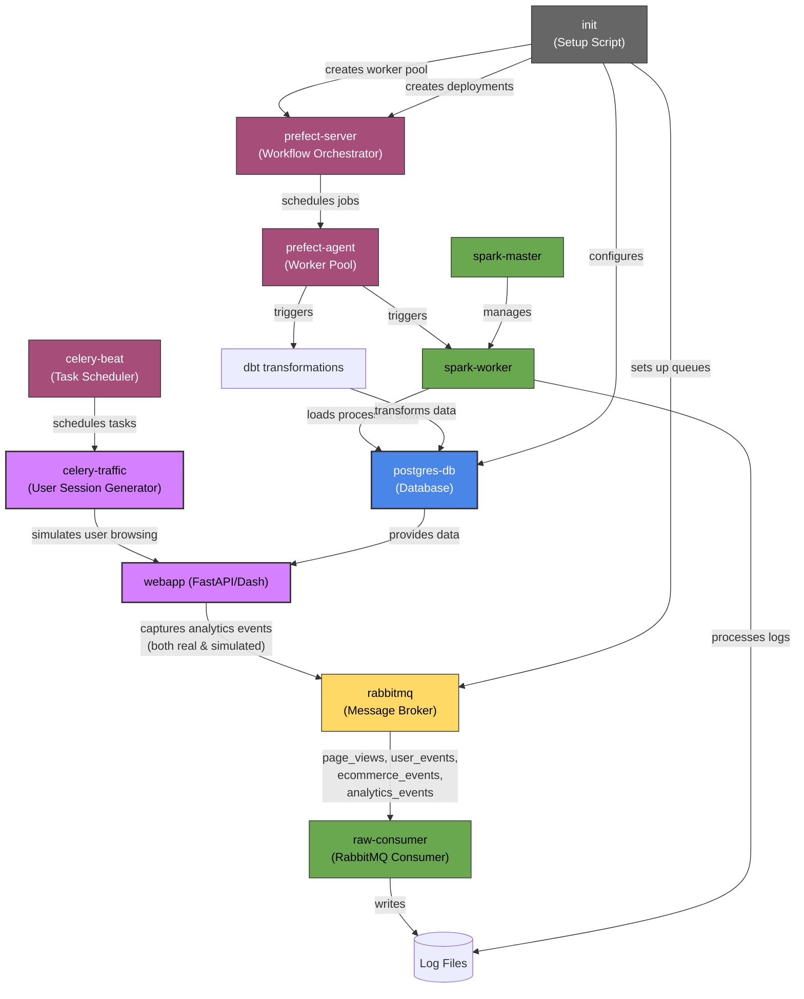

# GadgetGrove Analytics Pipeline

This project demonstrates a full-stack, containerized analytics pipeline for an e-commerce platform using FastAPI, Celery, RabbitMQ, Spark, dbt, PostgreSQL, and Prefect. It includes synthetic traffic generation, raw log ingestion, event processing, transformation, and a live dashboard.

## 🧩 System Overview

### Mermaid Diagram



---

## 🧱 Components Breakdown

| Service          | Purpose                                                                 |
| ---------------- | ----------------------------------------------------------------------- |
| `webapp`         | FastAPI + Dash UI for the e-commerce site and analytics dashboard       |
| `celery-traffic` | Simulates user traffic and publishes events to RabbitMQ                 |
| `celery-beat`    | Schedules periodic traffic generation                                   |
| `raw-consumer`   | Consumes RabbitMQ events and stores raw JSON logs on disk               |
| `rabbitmq`       | Message broker between traffic generation and raw consumer              |
| `postgres-db`    | Stores all app data, analytics tables (raw + transformed), and metadata |
| `spark-master`   | Spark coordinator for distributed processing of raw logs                |
| `spark-worker`   | Processes files for transformations into PostgreSQL                     |
| `prefect-server` | Orchestrates data pipeline flows (Spark + dbt)                          |
| `prefect-agent`  | Worker that executes Spark and dbt flows on a schedule                  |
| `dbt`            | Transforms raw*data.* into analytics.\_ views used by dashboard         |
| `init`           | Bootstraps queues, PostgreSQL schema, and registers Prefect deployments |
| `datadog-agent`  | Observability: collects APM, infra metrics, and integrations            |

---

## 🚀 Getting Started

- Install Docker + Docker Compose
- Clone this repo
- Configure `.env` with your Datadog API key and optional Git metadata
- Run the project:
  ```bash
  make build
  make up
  ```

See `Makefile` for available commands.

---

## 📊 Dashboard Access

- **WebApp**: http://localhost:8000/
- **Analytics Dashboard**: http://localhost:8050/
- **Prefect UI**: http://localhost:4200/

---

## 🧪 Synthetic Data Flow

1. Celery Beat schedules traffic every minute.
2. Celery Traffic worker generates events → RabbitMQ
3. Raw consumer (pika) logs JSON events → disk
4. Prefect agent triggers Spark job → transforms to PostgreSQL `raw_data.*`
5. dbt transforms → `analytics.*`
6. Analytics dashboard queries `analytics.*`

---

## 📦 Observability

All services are instrumented with `ddtrace` for:

- APM traces
- Logs
- Infra metrics
- Custom metrics (event counts, ingestion timing)

Prefect generates artifacts for:

- Spark ingestion summaries
- Archive cleanup reports
